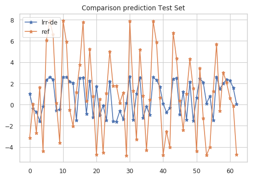
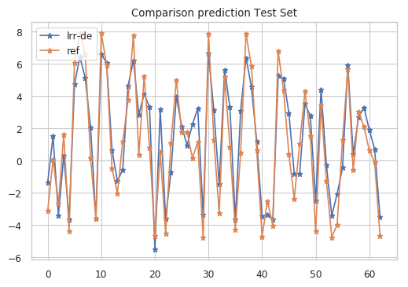
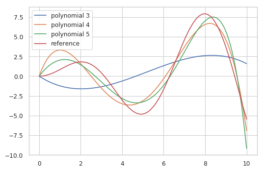
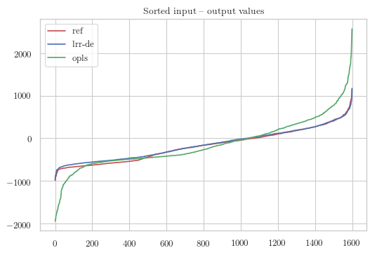
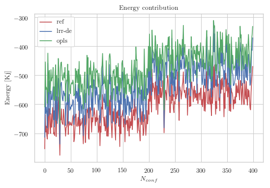
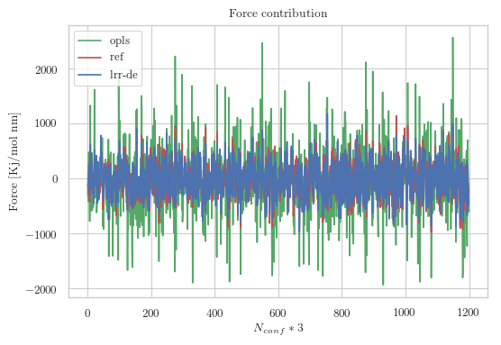
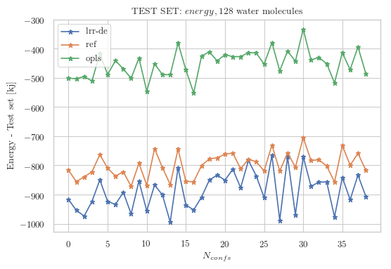
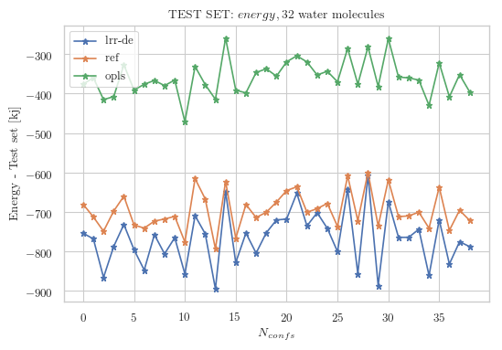
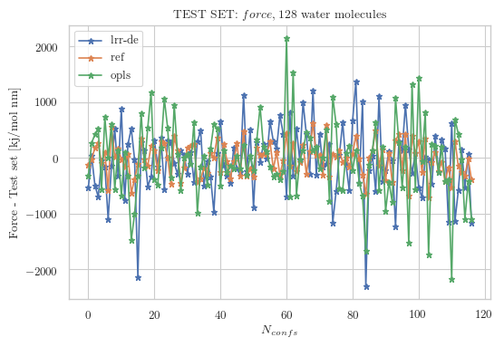
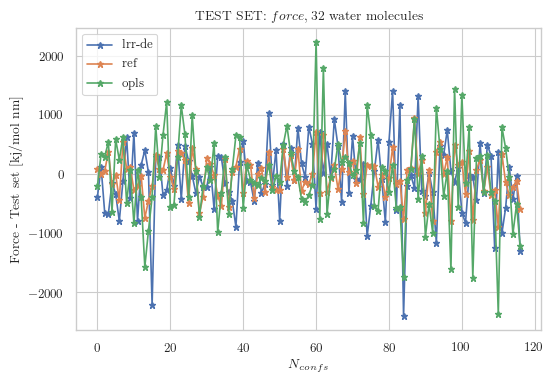

Tutorial
========

In this section we are going to go through the entire fitting procedure for the parameterization of 
the non-bonded component of a force field of an ion in condensed phase.

Theory
~~~~~~~~~~~

Linear Ridge Regression:
        Given a data set :math:`{x_l,y_l}` where :math:`x_l` is  the :math:`l-th` inputvector, 
        and :math:`y_l` is the corresponding output value, an interpolative general model can be
        built as a linear combination of the functions :math:`\phi(x,θ)`, called predictors or 
        descriptors in the language of statistical learning:

        :math:`y_{est} = \sum_j^{N_{functions}} C_j \phi_j(x,\theta)`

        where :math:`{C}` and :math:`{θ}` are the linear and non-linear parameters of the model,
        respectively. In the linear ridge regression technique, the optimal linear parameters are
        obtained minimizing the regularized cost function:

        :math:`J = \frac{1}{2M} \sum_j^M \biggl( y - \sum_j^{N_{functions}} C_j \phi_j(x,\theta) \biggl)^2 + \lambda\sum_j^{N_{functions}} C_j^2`

        where :math:`N_b` is the number of the target quantities, :math:`w_b` is the scaled weight of the :math:`b-th` set of targets, of size :math:`M_B`, calculated as:
       
        :math:`w_b = \frac{w^{'}_{b}}{\sqrt{\frac{1}{M_b}\sum_l^{M_b} (y_{l,b} - y_b)^2}}`

        where :math:`w_b^{'}` are the effective weights, subjects to constraint :math:`w_b^{'} \in [0,1]` and :math:`\sum_b^{N_b} w_b^{'} = 1`.
        The minimization of the weighted cost function with respect to the linear parameters is given by a normal equation that includes the weights:

        :math:`\tilde{C_j} = (H^T W H + 2M\lambda I)^{-1} (H^T Wy)`

        being :math:`W` the diagonal matrix containing the :math:`w_b` values and :math:`M = \sum_b^{N_b} M_b`.

        The evaluation of the Normal equation can be performed if the values of :math:`\lambda` and :math:`\{ \theta \}` parameters have been already
        established, therefore they are considered as hyperparameters. In order to obtain the optimal values of the hyperparameters we exploited the 
        minimization of the cross-validation error:
        
        :math:`LOOCV_{error}(\lambda,{\theta}) =  \sum_b^{N_b} \biggl ( \frac{1}{M} \sum_l^M  ( \frac{ y_l - y_{est}(x_l,\lambda,{\theta})}{1 - h_l} )^2  w_b \biggl)`

        :math:`h_l = \frac{1}{M} + \frac{w_l ( \tilde{\varphi_l} - \overline{\tilde{\varphi}})^2 }{ \sum_{l'}^M w_{l^{'}} (\tilde{\varphi_{l'}} - \overline{\tilde{\varphi}})^2}`
        
        Cross-validation is a resampling method applied in statistical learning for the model assessment and model selection. The quality of a model 
        is measured by the \textit{generalization error}, the expected prediction error on new data.
        
        The minimization of the LOOCV_{error} with respect to :math:`\lambda` and :math:`\theta` is a non convex optimization, therefore a meta-heuristic 
        approach is necessary to search for the global minimum of the objective function. To attain this task we exploited the evolutionary algorithm known 
        as differential evolution, DE.

Tutorial Notebook Fitting
~~~~~~~~~~~~~~~~~~~~~~~~~~~~~

Example 1
---------

Example 1: —- Fitting of a function x*sin(x) with a polynomial of 5th degree

.. code:: ipython3

    # First Example
    
    # General imports
    import os
    import time
    import numpy as np
    import seaborn
    seaborn.set(style='whitegrid')
    seaborn.set_context('paper')
    # -------------------------------------------------------------------------------------------------------------------------------------------
    
    # Directory with the ensemble of functions
    fun_path = "/path/tomodule/"
    os.chdir(fun_path)
    
    # Import of modules
    from fit_parser_g        import *
    from fit_multi_objective import *
    from fit_normal_solver   import *
    from fit_fast_loocv      import *
    from fit_testing         import *
    from fit_tool            import *
    
    # -------------------------------------------------------------------------------------------------------------------------------------------
    # Directory with the input files
    path_data = "/path/tofile/"
    os.chdir(path_data)
    
    # Definition of input variabels
    def f(x):
        """ function to approximate by polynomial interpolation"""
        return x * np.sin(x)
    
    # generate points and keep a subset of them
    x_ns   = np.linspace(0, 10, 250)
    x_plot = np.linspace(0, 10, 250)
    
    # Reference data
    y = f(x_ns)
    
    # Input data
    X = np.vstack([x_ns, x_ns**2, x_ns**3, x_ns**4, x_ns**5]).T
    
    # Standardize the input variables
    mean, sigma, x_std = standardize_data(X)
    
    # -------------------------------------------------------------------------------------------------------------------------------------------
    # Work Directory
    work_data = "/path/towork/"
    os.chdir(path_data)
    
    # Input parameters for the Ridge Regression
    # -------------------------------------------------------------------------------------------------------------------------------------------
    input_params            = {}
    # -------------------------------------------------------------------------------------------------------------------------------------------
    input_params['y']       = y                                      # Reference data
    input_params['x']       = x_std                                  # Standardize X 
    input_params['sigma']   = sigma                                  # Standard Deviation of the X
    input_params['borders'] = np.matrix([10e-15, 10e-1])             # Borders for the search of the hyperparameter lambda
    input_params['n_confs'] = np.shape(x_ns)[0]                      # Size of the input set 
    input_params['n_train'] = np.shape(x_ns)[0]*0.8                  # Definition of the training set percentage 
    input_params['outdir']  = work_data                              # Where to save output figures
    input_params['de']      = [10, 0.7, 0.9, 50]                     # Parameters for the Differential Evolution 
                            # [n,  F,   Cr, step_delta]  
                            # n:population, F:scaling, Cr:crossover probability, step_delta:number of generations before stop
    # -------------------------------------------------------------------------------------------------------------------------------------------
    
    # Generation of the Test and Training Sets
    data_set = gen_data_set(input_params)
    data_set.gen_ts()
    
    # -------------------------------------------------------------------------------------------------------------------------------------------
    
    # Fitting 
    t0 = time.time()
    print("-------")
    print("Evaluating parameters")
    print("-------")
    
    lrrde = eval_lrrde(data_set, params_de = data_set.ip['de'])
    lrrde.eval_de()
    
    # Plot evolution of the cost function evaluation
    lrrde.plt_evo(save=False)                  # If save == True save the image
    
    # -------------------------------------------------------------------------------------------------------------------------------------------
     
    # Testing 
    t1 = time.time()
    total = t1-t0
    print("time fitting {}".format(total))
    
    # -------------------------------------------------------------------------------------------------------------------------------------------
    print("-------")
    print("Testing model")
    print("-------")
    # Prediction and error evaluation
    testing_data(data_set, lrrde.params,'y', save=False)                  # If save == True save the image

Output statistics

.. parsed-literal::

    -------
    Evaluating parameters
    -------
    LOOCV error 66.3, lambda [[6.02310102e-11]], Numero Iterazioni 251, Parametri : [ 3.44861341 -1.32372505 -0.15258124  0.07714854 -0.00530177]
    time fitting 3.5 s
    -------
    Testing model
    -------
    MSE (lrr-de) = 0.52
    MAE (lrr-de) = 0.57

Example 2
---------

Example 2: —- Comparison of fittings of a function x*sin(x) with a
polynomial of 5th, 4th, 3th degree

.. code:: ipython3

    # Second Example
    
    # generate points 
    x_ns   = np.linspace(0, 10, 250)
    x_plot = np.linspace(0, 10, 250)
    
    # Reference data
    y = f(x_ns)
    
    X3 = np.vstack([x_ns, x_ns**2, x_ns**3]).T
    X4 = np.vstack([x_ns, x_ns**2, x_ns**3, x_ns**4]).T
    X5 = np.vstack([x_ns, x_ns**2, x_ns**3, x_ns**4, x_ns**5]).T
    
    # Standardize the input variables
    mean, sigma3, x_std3 = standardize_data(X3)
    mean, sigma4, x_std4 = standardize_data(X4)
    mean, sigma5, x_std5 = standardize_data(X5)
    
    # -------------------------------------------------------------------------------------------------------------------------------------------
    
    # -------------------------------------------------------------------------------------------------------------------------------------------
    input_params['y']       = y                                       # Reference data
    input_params['x']       = x_std3                                  # Standardize X 
    input_params['sigma']   = sigma3                                  # Standard Deviation of the X
    data_set3 = gen_data_set(input_params)
    data_set3.gen_ts()
    lrrde3 = eval_lrrde(data_set3, params_de = data_set3.ip['de'])
    lrrde3.eval_de()
    testing_data(data_set3, lrrde3.params,'y')
    
    # -------------------------------------------------------------------------------------------------------------------------------------------
    input_params['y']       = y                                      # Reference data
    input_params['x']       = x_std4                                  # Standardize X 
    input_params['sigma']   = sigma4                                  # Standard Deviation of the X
    data_set4 = gen_data_set(input_params)
    data_set4.gen_ts()
    lrrde4 = eval_lrrde(data_set4, params_de = data_set4.ip['de'])
    lrrde4.eval_de()
    testing_data(data_set4, lrrde4.params,'y')
    
    # -------------------------------------------------------------------------------------------------------------------------------------------
    input_params['y']       = y                                      # Reference data
    input_params['x']       = x_std5                                 # Standardize X 
    input_params['sigma']   = sigma5                                 # Standard Deviation of the X
    data_set5 = gen_data_set(input_params)
    data_set5.gen_ts()
    lrrde5 = eval_lrrde(data_set5, params_de = data_set5.ip['de'])
    lrrde5.eval_de()
    testing_data(data_set5, lrrde5.params,'y')
    
    plt.figure(dpi=100)
    sns.set_context("paper")
    plt.plot(x_plot, np.dot(X3,lrrde3.params.T), label='polynomial 3')
    plt.plot(x_plot, np.dot(X4,lrrde4.params.T), label='polynomial 4')
    plt.plot(x_plot, np.dot(X5,lrrde5.params.T), label='polynomial 5')
    plt.plot(x_plot, y, label='reference')
    plt.legend()
    
    plt.show()

Output statistics

.. parsed-literal::

    LOOCV error 579.3, lambda [[2.26550152e-05]], Numero Iterazioni 251, Parametri : [-1.72009749  0.52716683 -0.03392483]
    MSE (lrr-de) = 6.1
    MAE (lrr-de) = 1.9
    -------
    LOOCV error 97.3, lambda [[5.73169707e-09]], Numero Iterazioni 251, Parametri : [ 7.38439328 -4.93497868  0.92061274 -0.05078846]
    MSE (lrr-de) = 1.0
    MAE (lrr-de) = 0.87
    -------
    LOOCV error 66.3, lambda [[6.0238273e-11]], Numero Iterazioni 251, Parametri : [ 3.44861227 -1.32372413 -0.15258149  0.07714857 -0.00530177]
    MSE (lrr-de) = 0.52
    MAE (lrr-de) = 0.57
    -------

.. image:: output_2_3.png

Tutorial Notebook Force Field
~~~~~~~~~~~~~~~~~~~~~~~~~~~~~

Initialization
--------------

Go to the directory where the module are stored and load them

.. code:: ipython3

    import os
    import time
    import seaborn
    seaborn.set(style='whitegrid')
    seaborn.set_context('paper')
    
    # Path to get to the python modules
    path_data = "/path/to/module"
    os.chdir(path_data)
    
    
    from parse_input     import *
    from distances       import *
    from multi_objective import *
    from normal_solver   import *
    from testing         import *

Set the initial parameters necessary for the fitting procedure:

.. code:: ipython3

    # --------------------------- User ------------------------------#
    # Set of input parameters for the lrr-de procedure
    
    input_params = {}
    flag_files   = {}
    training     = {}
    
    input_params['n_conf']        = 239                         # Number of total configurations
    input_params['n_test']        = 39                          # Dimension Test Set
    input_params['n_train']       = 200                         # Dimension Training Set
    input_params['len_vs']        = 0.09                        # Length of the Virtual Site
    input_params['n_vs']          = 2                           # Number of Virtual Sites
    
    input_params['index_ion']     = 1                           # Index of the ion in the coordinate file  
    input_params['N_atom']        = [385, 97]                   # Number of atom per system 
    input_params['N_water']       = [128, 32]                   # Number of water molecules per system
    
    input_params['old_params']    = [1, 0.278,0.4]              # Old FF Parameters 
                                                                # [Q, sigma, epsilon]                         
    
    input_params['n_functions']   = 3                           # 0 --> Var Ag: c6,c12   VS: q
                                                                # 1 --> Var Ag: c6,c12   VS: q, c12
                                                                # 2 --> Var Ag: c6,c12   VS: q, c6,c12
                                                                # 3 --> Var Ag: q,c6,c12 VS: q,c6,c12
                                                                # 4 --> Var Ag: q,c6,c12 VS: q 
                                                                # 5 --> Var Ag: q,c6,c12 VS: q, c12
                    
    input_params['q_value']       = 0.8                         # if nfunctions = 0,1,2 inserire valore della carica
    input_params['file_dir']      = "/path/to/files"            # Directory of the input files
    input_params['outdir']        = "/path/for/output"          # Directory for the output files
    input_params['counterpoise']  = True                        # If the Counterpoise correction has been applied
    input_params['borders']       = np.matrix([10e-15, 10e-1])  # Border for the search of the hyperparameter
    
    # Flag for the files to be read
    flag_files['topology']        = True
    flag_files['energy']          = True
    flag_files['force']           = True  
    flag_files['coordinate']      = True 

Once the input parameters has been set is possible to define a test and a training set.
The *parser* class will parse the inputs file and through the method *eval_distances*
evaluates the vector and matrix of distances of the water molecules from the reference ion.
The class *input_setup* will evaluate from the distances and the topology of each system
the value of the energies and the forces evaluated through the following formula:

        :math:`E = \frac{q}{r} + \frac{C_{12}^{0.5}}{r^{12}} - \frac{C_6^{0.5}}{r^{6}}`

        :math:`F = \frac{\partial E}{\partial r}`

Training-Test Set
-----------------

.. code:: ipython3

    # ------------------------ Training Set---------------------------------#
    
    print("----------------------------------------------------------------")
    print("Generating Training and Test Set")
    
    ## Parsing + Distance matrices
    t0 = time.time()
    _parser = parser(input_params, flag_files)
    _parser.eval_distances()
    input_params = _parser.input_params
    
    
    # Training set
    energy_ts = input_setup(input_params, flag="energy", weight=[1,1])
    force_ts  = input_setup(input_params, flag="force",  weight=[30,30])
    
    training['energy_ts'] = energy_ts 
    training['force_ts']  = force_ts
    data_set  = training_set(training)
    
    data_set.model_descriptor()
    t1 = time.time()
    total = t1-t0
    print("Time employed to build the Training and Test Set {} s".format(np.round(total,2)))
    print("----------------------------------------------------------------")

.. parsed-literal::

    ----------------------------------------------------------------
    Generating Training and Test Set
    Time employed to build the Training and Test Set 4.76 s
    ----------------------------------------------------------------

Fitting
-------

.. code:: ipython3

    # ------------------------ Fitting -------------------------------------#
    print("----------------------------------------------------------------")
    t0 = time.time()
    print("Evaluating parameters ---> LRRDE")
    print("----------------------------------------------------------------")
    lrrde = eval_lrrde(data_set)
    lrrde.eval_de()

.. parsed-literal::

    ----------------------------------------------------------------
    Evaluating parameters ---> LRRDE
    ----------------------------------------------------------------
    Scaled MAE 111.65, loocv 4892.98
    LOOCV error 4892.98, lambda [[1.45139576e-15]], Numero Iterazioni 251, Parametri :
    ----------------------------------------------------------------
    Resulting Parameters
    ----------------------------------------------------------------
    Atom: q  1.415915 c12  0.000060 c6  -0.137399
    VS1: q_vs1   -0.087001 c12_vs1   0.000000 c6_vs1 0.003444
    VS2: q_vs2   -0.060761 c12_vs2   0.000000 c6_vs2   0.001554
    ----------------------------------------------------------------
    Statistics:
    ----------------------------------------------------------------
    R2 score:  lrr-de 0.859
    MSE score: lrr-de 262352.26
    MAE score: lrr-de 413.55
    R2 score  old params: -0.078
    MSE score old params: 461476.95
    MAE score old params: 525.88
    ----------------------------------------------------------------

Testing
-------

.. code:: ipython3

    # ------------------------ Testing -------------------------------------#
    t1 = time.time()
    total = t1-t0
    print("Time employed for the fitting {} s".format(total))
    #
    print("----------------------------------------------------------------")
    print("Prediction")
    print("----------------------------------------------------------------")
    #
    testing_data(data_set = data_set, params = lrrde.params, plot = 'y')

.. parsed-literal::

    Time employed for the fitting 158.32679414749146 s
    ----------------------------------------------------------------
    Prediction
    ----------------------------------------------------------------
    SET: energy, # of water molecules 128
    MSE (lrr-de) = 13339.6
    MAE (opls)   = 347.5
    MAE (lrr-de) = 87.2
    -------
    SET: energy, # of water molecules 32
    MSE (lrr-de) = 11615.4
    MAE (opls)   = 336.8
    MAE (lrr-de) = 68.9
    -------
    SET: force, # of water molecules 128
    MSE (lrr-de) = 458332.2
    MAE (opls)   = 564.9
    MAE (lrr-de) = 218.4
    -------
    SET: force, # of water molecules 32
    MSE (lrr-de) = 514995.9
    MAE (opls)   = 620.9
    MAE (lrr-de) = 181.4
    -------

